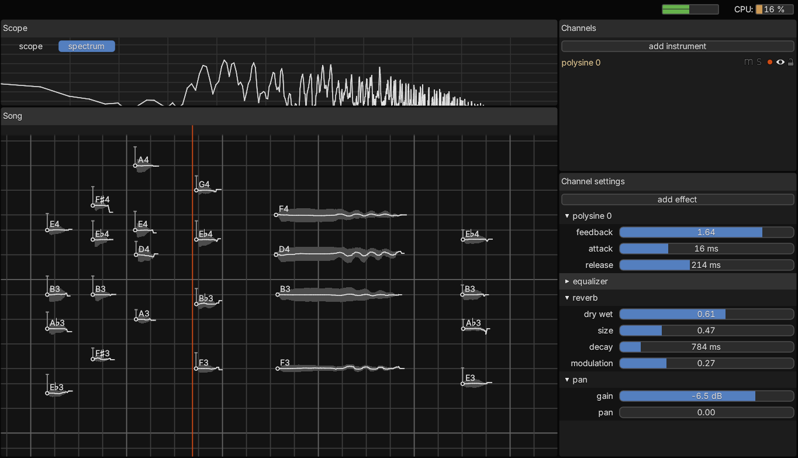

# Tessera



Experimental DAW with a focus on microtonal composition, expressiveness and physical modelling.

[Get the latest release here.](https://github.com/Sin-tel/tessera/releases/latest)

Windows only for now, if you want to help test the Linux and MacOS builds, you can download them from the workflows in the [actions](https://github.com/Sin-tel/tessera/actions) tab.

For help, see the [manual](./manual.md).

## Build instructions
* Make sure you have installed [Rust](https://www.rust-lang.org/tools/install).
* Use `cargo run` to build and start the application in debug mode.

For an optimized build, use `cargo run --release`.
### Windows
To use ASIO, we need the sdk. Download it from <https://www.steinberg.net/asiosdk> and put it in some convenient like `C:\sdk\ASIOSDK`.
Then, set "CPAL_ASIO_DIR" in your environment variables to this path.

You also need LLVM installed. If you haven't, go to <https://github.com/llvm/llvm-project/releases/latest> and get 'clang+llvm-[version]-x86_64-pc-windows-msvc.tar.xz'

More detailed build instructions are on the [cpal repo](https://github.com/RustAudio/cpal#asio-on-windows).

### Linux
JACK is enabled by default.

Install the necessary dependencies:
```bash
sudo apt get libasound2-dev libjack-jackd2-dev libjack-jackd2-0 libdbus-1-dev
```

### MacOS
Not tested.

